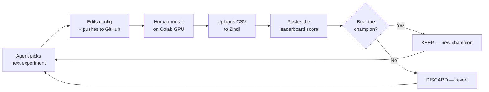
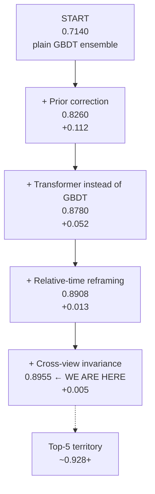
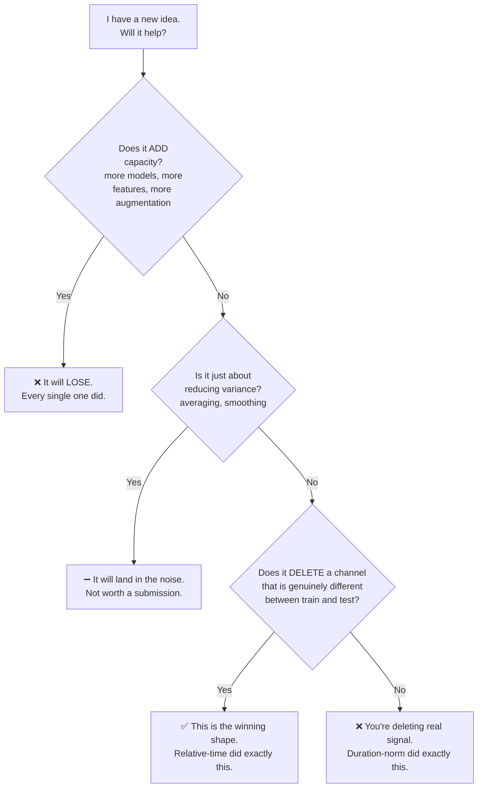
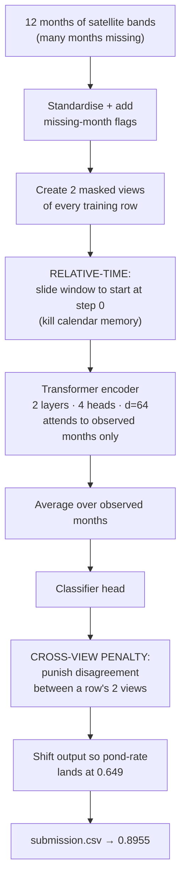
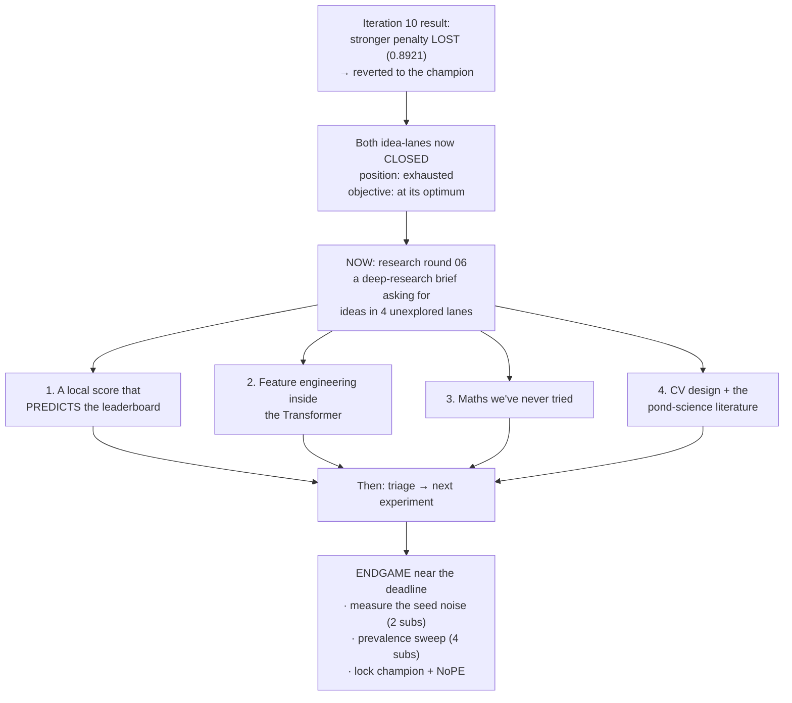

# The Journey So Far — GeoAI Aquaculture Pond Identification

**A plain-English story of what we tried, what failed, what we kept, and where we stand.**

- **Competition:** GeoAI Aquaculture Pond Identification (Zindi / FAO / ITU)
- **Deadline:** 2026-08-16 · **Submissions allowed:** 5 per day
- **Where we started:** public leaderboard **0.7140**
- **Where we are now:** public leaderboard **0.8955**
- **Total climb:** **+0.1815**
- **Last updated:** 2026-07-21

---

## 1. The problem in one paragraph

We are given 12 months of satellite readings (radar + optical) for each map cell, and we must
say whether that cell is an **aquaculture pond** or not.

The catch — and it is the whole story of this project — is that the **training data and the
test data are deliberately different**. The competition organisers built them that way. A model
can memorise the training set almost perfectly and still transfer badly. We measured this: a
classifier can tell a training row from a test row with **99% accuracy**.

That single fact reshaped every decision below.

---

## 2. The one rule we run on

> **The local score lies. The leaderboard is the only truth.**

Early on we found two models with *identical* local cross-validation scores whose leaderboard
scores differed by **0.05**. Later it got worse — the local score became actively **backwards**:

| Run | Local score (OOF) | Leaderboard | |
|---|---|---|---|
| K=4 augmentation | **0.9840** (best local) | 0.8665 | 2nd-worst on LB |
| Relative-time | 0.9811 (lower) | 0.8908 | won |
| Cross-view invariance | **0.9753** (lowest) | **0.8955** | **best ever** |

So the rule: **we never keep an idea because it scored well locally.** Every keep/discard
decision waits for a real leaderboard number. That is why the loop has a human in it.

---

## 3. How far we've come

Four things have ever worked. Everything else lost.

| # | The step that worked | Why it worked, in plain terms | Gain |
|---|---|---|---|
| 1 | **Prior correction** | The test set has far more ponds (~65%) than the training set (~40%). We shifted the model's output so it predicts ponds at the right rate. | **+0.112** |
| 2 | **Swap GBDT → Transformer** | The Transformer looks only at the months that were actually observed. The GBDT flattened everything into averages and memorised the training region. | **+0.052** |
| 3 | **Relative-time reframing** | Stop telling the model "this is March." Tell it "this is month 1 of the window." It was memorising the calendar, which does not carry over to the test area. | **+0.013** |
| 4 | **Cross-view invariance** | Show the model the same cell with different months hidden, and *penalise it* for changing its mind. Teaches it that the answer shouldn't depend on which months you happened to see. | **+0.005** |

---

## 4. What diverged — the things we tried and dropped

We have spent 10 experiments. **Six lost, one tied, three won.** This is the honest scoreboard.

| Idea | What it did | LB | Verdict |
|---|---|---|---|
| GBDT + Transformer blend | Average two different models | 0.8705 | ❌ −0.0075 — the GBDT dragged the good model down |
| Per-cell detrend channels | Add "level-removed" input features | **0.8266** | ❌ −0.0514 — our worst result ever |
| More augmentation (K=4) | Show each row 4 masked views instead of 2 | 0.8665 | ❌ −0.0115 — best local score, near-worst LB |
| Test-time augmentation | Average predictions over 8 masked views | 0.8885 | ❌ −0.0023 — no harm, no help |
| Duration-normalised positions | Squeeze every window onto a shared 0→1 timeline | 0.8844 | ❌ −0.0064 — deleted useful info |
| NoPE (no position at all) | Treat the months as an unordered bag | 0.8917 | ➖ tie — **kept as a backup model** |
| Stronger cross-view penalty | Turn our newest win up 3× | 0.8921 | ❌ −0.0034 — we had already found the sweet spot |

**Also permanently rejected** (researched, argued, and ruled out): EM/Saerens prior estimation
(rejected 3 separate times), water-index threshold features, self-training on the test set,
importance weighting / domain-adversarial training, stacking, temperature scaling, and anything
using pretrained or external models (banned by the rules).

---

## 5. The one lesson that explains all of it

Every failure and every success fits one rule we discovered the hard way:

In one sentence: **don't give the model more — take away the specific thing it is memorising.**

Adding always hurt. Deleting helped *only* when the deleted thing was genuinely different
between the training area and the test area. Calendar month was different → deleting it won.
Window length was already matched → deleting it lost.

**One more constraint that governs everything:** the public leaderboard is scored on only
**~309 rows**, which means it carries roughly **±0.01 of random noise**. We therefore refuse to
test small ideas — a +0.003 improvement is simply unmeasurable. We only spend a submission on
changes big enough to be *seen*.

---

## 6. What we are using right now

**The champion, in words:** a Transformer we trained from scratch (no pretrained weights — they
are banned), which reads only the months that actually exist, is told *relative* time rather
than calendar time, is trained to give the same answer no matter which months are hidden, and
finally has its output nudged so it predicts ponds at the right frequency.

**The settings that define it:**

| Setting | Value | Why |
|---|---|---|
| `relative_time` | `true` | Win #3 — deletes calendar memorisation |
| `consistency_lambda` | `1.0` | Win #4 — the cross-view penalty |
| `K` (training views) | `2` | 4 was tested and lost; 2 is a sharp optimum |
| `pos_encoding` | `learned` | dnorm lost, none tied |
| `prevalence_target` | `0.649` | Win #1 — the operating point |
| all `channels.*` | `false` | Every added channel lost |
| `tta.enable` | `false` | Tested, landed in the noise |

---

## 7. How strong is it?

| | Score |
|---|---|
| Where we started | 0.7140 |
| **Our champion today** | **0.8955** |
| Top-5 on the board | ~0.928 – 0.945 |
| Leader | ~0.9452 |
| **Gap left to close** | **~+0.033** |

**Honest read:** we are in solid, competitive territory and we have closed 85% of the distance
from our starting point to the top of the board. The remaining +0.033 is hard — it is roughly
three times the size of our last two wins combined, and the two biggest levers (calendar
position, and per-cell signal strength) are now exhausted and proven-toxic respectively.

**Confidence in the champion is high** because the wins were not lucky toggles — each one has a
mechanism we can state and that we verified in the run logs. The most recent win, for example,
measurably reduced the model's overconfidence (its known weakness) exactly as predicted.

**We also hold a second, deliberately different model** (the NoPE set encoder, 0.8917). It ties
our champion on the public board but is built on a completely different assumption, so it fails
on *different rows*. That is insurance for the private leaderboard.

---

## 8. What's in the pipeline

**What just happened:** iteration 10 turned the cross-view penalty up 3× and *lost* (0.8921). The
useful part is *why*. It de-saturated the model even further than the winning setting did — yet
its ranking ability was completely untouched (AUC held at 0.9896). So the loss isn't the model
breaking; it's simply that **a little of this medicine helps and more does not.** We had already
found the sweet spot. That lane is now closed at its optimum.

**Where that leaves us:** both of our productive lanes are measured closed, and we are out of
queued ideas big enough to clear the ±0.01 noise. Importantly, **submissions are no longer the
constraint** — we have ~130 left over ~26 days. *Ideas* are the constraint, and so is our ability
to *measure* small ones.

**So the next move is research, not another guess.** `gemini_loop/UPDATE_06.md` is a deep-research
brief going to Claude Fable, asking for depth in four lanes we have never explored:

1. **A local score that predicts the leaderboard.** The single highest-value thing available. Right
   now we cannot tell a real +0.005 from noise without spending a submission — our champion's own
   margin sits at that edge. If we could screen ideas offline, our 130 spare submissions suddenly
   become useful instead of unusable.
2. **Feature engineering inside the Transformer.** An admitted blind spot: our champion sees only
   24 raw channels. Every richer feature we ever built lives in the abandoned GBDT branch.
3. **Mathematics we've never touched** — robust optimization, optimal transport, ranking losses
   (worth noting: AUC is 40% of the score and we optimise plain cross-entropy).
4. **CV design and the actual pond-science literature** — is there a physical signature of
   aquaculture ponds our architecture simply cannot represent?

**Then the endgame, close to the deadline:** measure the true seed-to-seed spread (2 submissions —
we have always *assumed* ±0.01 from theory but never actually measured it), run the one-time
prevalence sweep (4 submissions — our 0.649 was tuned for a much older model), and lock the two
finalists.

**One open question for you:** we still need to confirm on the Zindi rules page whether the
private leaderboard **auto-selects your best public submission**, or lets you **nominate two
finalists**. If it is the latter, our NoPE backup is genuinely valuable insurance. If it is the
former, we should put every remaining submission into raising the champion alone.

---

## 9. Where everything lives

| File | What it holds |
|---|---|
| `PROJECT_STATE.md` | The master state doc — carry this to any new cloud account |
| `experiments/LB_LOG.md` | Every submission and its leaderboard score (the reward signal) |
| `gemini_loop/AGENT_BRIEF.md` | The standing instructions for the agent driving the loop |
| `experiments/run_current.sh` | The single experiment currently staged to run |
| `config/config.yaml` | Every setting, in one place |
| `src/seq_model.py` | The champion Transformer itself |
